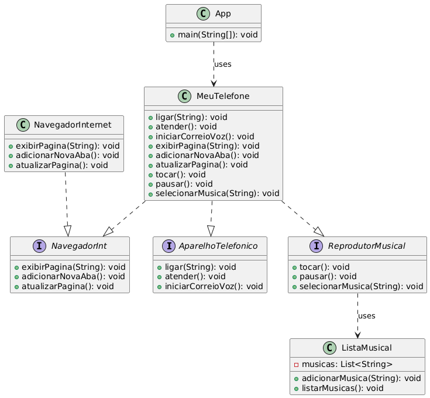

# 📱 Projeto PoolPhone

Este projeto foi desenvolvido em **Java** e simula as principais funções de um celular, contendo:

- 🎵 **Reprodutor Musical**  
- 📞 **Aparelho Telefônico**  
- 🌐 **Navegador de Internet**

--- 

## 📊 Diagrama UML

Abaixo está o diagrama UML que representa a estrutura do projeto:



--- 

## 🚀 Tecnologias Utilizadas

- Java ☕
- UML para modelagem
- VS Code como IDE
- Git & GitHub para versionamento

---

## ⚙️ Como Executar o Projeto

1. Clone o repositório:
   ```bash
   git clone https://github.com/<username>/<repository-name>.git
